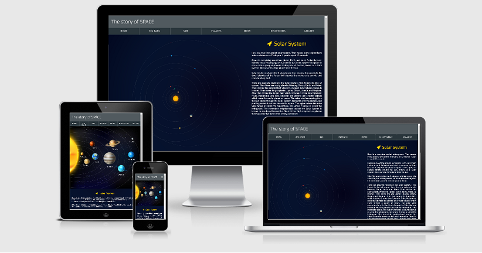

# Aleksandra Kula - The story of space 
Code Institute, User - Centric frontent development 2019
# User Story

This is educational project for elementary school students. They come to the website with questions in need of answering and learn about our Solar System.
The purposes of this project are to promote STEM subjects in elementary schools 
while learning how to build good looking responsive websites by just using CSS3.

## Demo 

Live demo can be found here: https://olaqla.github.io/First-Milestones-Project/

## UX 
In my design of user experience I chose to use rather dark theme that would be consistent with 
the main topic of the website:

-  `#515a5f`

-  `#05122e`

As one of the main purposes of this website is 
learning CSS3 I chose to use different layouts on the pages to make sure that I cover using the latest 
layout techniques as grid and flex as well as traditional methods using floats, all in responsive fashion.

## Features:
Implemented:
* Documentation - ReadMe File
* Colour Scheme
* HTML, CSS(flex, grid, float)
* Bootstrap: icon,
* Responsive design: Mobile First
* UX elements:
  - User Flow
  - Animations
  - Transitions
  - Hovers
* Accesibility
* Git - Version Control System
* GitHub - Remote Repository
* Deployed - Hosted on Github Pages
* Tested manually

### Main menu

Main menu on top of the page is responsive. It is a page-wide stripe of horizontally laid out buttons on bigger screens and turns into a hamburger menu on mobile devices and small screens. 
In order to provide smoother user experience buttons are animated when the page is loaded and also provide a visual feedback effect by getting slighty bigger and changing text color when hovered over. 
Planets dropdown is built using relative positioning of elements and is available as a static page on smaller screens. 
Each of the menu options opens a subsection covering a specific topic. 

### Planet pages

Main planets page is built with CSS grid and each of the images link to a page about specific planet. 
All planet pages use the same layout with a single relevant image and a text that describes it. 

### Gallery page

Gallery page was built using CSS grid and flex to provide interesting layout of images. The layout changes to a scrolable list on small devices. 

### Footer

Footer contains few buttons that link to important pages where users can find more up to date information. 

## Technologies

1. HTML 5 
   - HTML for structure
2. CSS3 (Selectors, Grid, Flex, Floats, Positioning, Transitions, Media Queries) 
   - CSS for Styling
3. JavaScrit
   - Minimal javascript to open/close hamburger menu
4. Google Chrome
   - Used for browser and dev tools
5. Google
   - Google used for research
6. Bootstrap
   - Minimal bootstrapp for icon
7. Git used for Version Control
8. GitHub
   - Repository hosted on GitHub
9. Github Pages
   - Website hosted on Github Pages
10. Am I Responsive
   - Testing responsiveness of the website

## Testing 

Website was tested manually using multiple browsers (Chrome, Firefox, Opera, Edge).
Each html file was tested in multiple screen resolution and in mobile device modes, available in browsers developer tools. 

## Deployment / Hosting

Application is hosted using Github pages so no deployment process other than configuring repository were necessary.

## Credits

### Media

All the images are linked to images found in google search results.
The pictures in gallery were downloaded from google result links and scaled down.
Videos are linked to youtube.

### Acknowledgements

Styles used to build solar system model were crafted manually, following inspiration from: https://codepen.io/kowlor/pen/ZYYQoy

** Purpose of this project is educaional **
